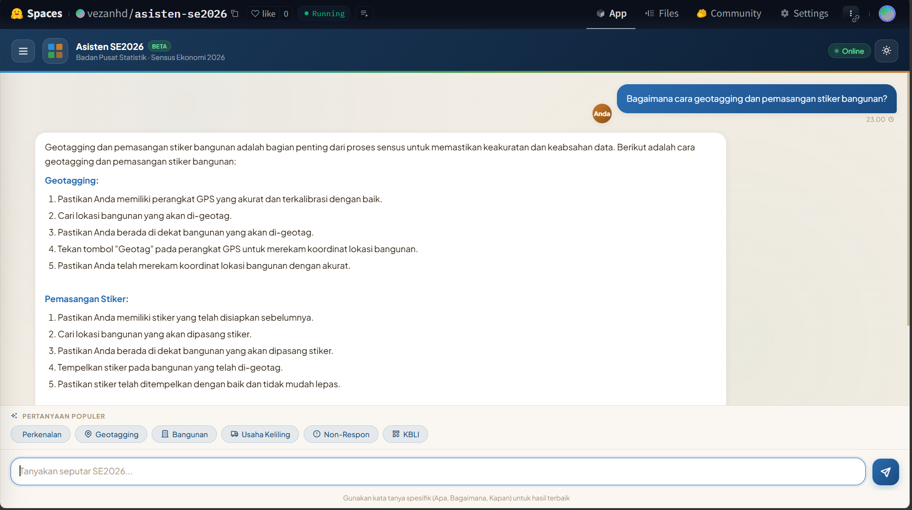
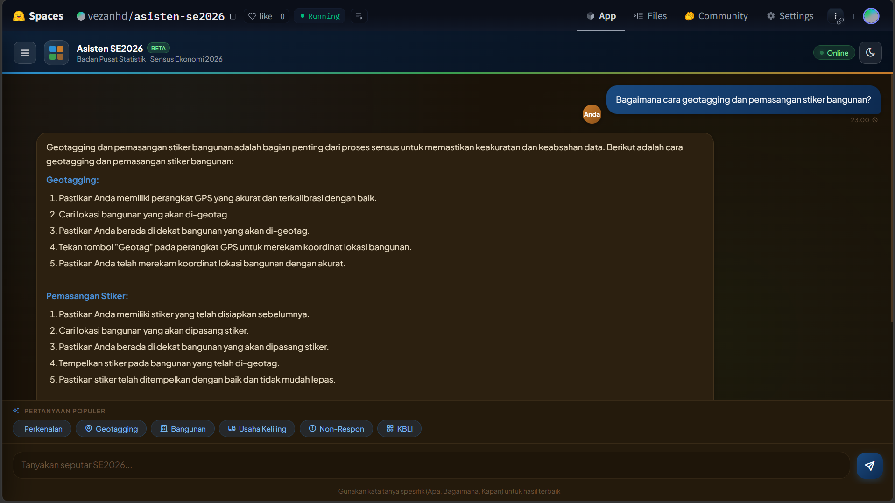
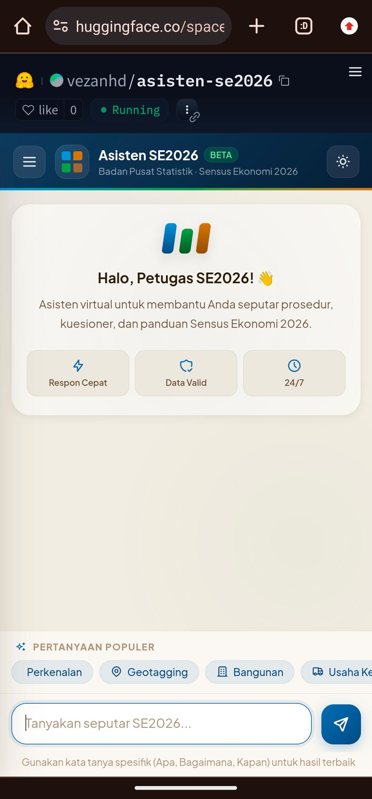

# 🤖 Asisten Virtual SE2026

Chatbot AI berbasis RAG (Retrieval-Augmented Generation) untuk membantu petugas lapangan Sensus Ekonomi 2026 Badan Pusat Statistik Indonesia.


---

## 📋 Daftar Isi

- [Overview](#-overview)
- [Fitur Utama](#-fitur-utama)
- [Tech Stack](#-tech-stack)
- [Arsitektur Sistem](#-arsitektur-sistem)
- [Instalasi](#-instalasi)
- [Deployment](#-deployment)
- [Konfigurasi](#-konfigurasi)
- [API Endpoints](#-api-endpoints)
- [Performance](#-performance)
- [Screenshots](#-screenshots)
- [Learning Points](#-learning-points)
- [Author](#-author)
- [Acknowledgments](#-acknowledgments)

---

##  Overview

**Asisten Virtual SE2026** adalah chatbot AI yang dirancang khusus untuk membantu petugas PPL/PML dalam melaksanakan Sensus Ekonomi 2026. Sistem menggunakan arsitektur **RAG (Retrieval-Augmented Generation)** dengan knowledge base dari dokumen resmi BPS, sehingga jawaban yang diberikan akurat, kontekstual, dan sesuai dengan pedoman resmi sensus.

### Masalah yang Diangkat

Petugas lapangan SE2026 sering menghadapi tantangan:
- 📚 **Dokumentasi kompleks**: Ribuan halaman pedoman teknis, aturan KBLI 2025, dan kasus batas
- ⏱️ **Kebutuhan jawaban cepat**: Petugas butuh jawaban instan saat di lapangan
- 🎯 **Konsistensi data**: Kesalahan interpretasi konsep berdampak pada kualitas data nasional

### Solusi

Chatbot AI yang "telah membaca" seluruh materi pelatihan resmi SE2026 dan dapat menjawab pertanyaan dalam bahasa natural dengan referensi yang akurat.

---

## ✨ Fitur Utama

### 🧠 AI & RAG
- **Retrieval-Augmented Generation**: Jawaban berbasis dokumen resmi BPS, bukan hallucination
- **Query Expansion**: Mengubah pertanyaan informal ("masjid di data ga?") ke kata kunci formal
- **Smart Fallback**: Otomatis beralih ke model ringan saat rate limit API
- **Conversation Memory**: Mengingat konteks percakapan sebelumnya (6 pesan terakhir)

### 📊 Data & Knowledge Base
- **Vector Search**: ChromaDB dengan embeddings multilingual (MiniLM-L12-v2)
- **Smart Chunking**: Chunk size 1500 dengan overlap 300, optimized untuk tabel markdown
- **Diverse Retrieval**: Max 2 chunks per dokumen untuk variasi konteks
- **Persistent Storage**: Vector store tersimpan, tidak perlu rebuild setiap startup

### 💬 User Experience
- **Markdown Support**: Bold, italic, lists, code blocks, dan formatting lainnya
- **Dark/Light Mode**: UI modern dengan tema gelap/terang
- **Mobile Responsive**: Bisa diakses dari smartphone petugas di lapangan
- **Copy Response**: Tombol salin jawaban untuk referensi offline

### 🔧 Developer Features
- **Token Usage Tracker**: Monitoring real-time penggunaan API tokens
- **Unanswered Questions Log**: Tracking pertanyaan yang tidak terjawab untuk improve KB
- **Health Check Endpoint**: Monitoring status aplikasi
- **Graceful Shutdown**: Cleanup resources saat aplikasi stop

---

## 🛠️ Tech Stack

### Backend
| Teknologi | Versi | Fungsi |
|-----------|-------|--------|
| **Python** | 3.11 | Runtime utama |
| **Flask** | 3.0.0 | Web framework |
| **Gunicorn** | 22.0.0 | Production WSGI server |
| **Groq API** | 0.18.0 | LLM provider (Llama 3.3 70B & 3.1 8B) |
| **LangChain** | 0.3.0 | RAG framework |
| **ChromaDB** | 0.5.0 | Vector database |
| **Sentence-Transformers** | 3.0.1 | Embeddings model |

### Frontend
| Teknologi | Fungsi |
|-----------|--------|
| **HTML5/CSS3** | UI modern dengan CSS variables |
| **JavaScript** | Vanilla JS untuk interaktivitas |
| **Tabler Icons** | Icon library |
| **Plus Jakarta Sans** | Typography |

### DevOps & Deployment
| Teknologi | Fungsi |
|-----------|--------|
| **Docker** | Containerization |
| **Hugging Face Spaces** | Cloud deployment |
| **Git** | Version control |

---

## ️ Arsitektur Sistem

```
─────────────────────────────────────────────────────────────┐
│                      USER INTERFACE                          │
│  ┌──────────────────────────────────────────────────────┐  │
│  │  Chat Interface (HTML/CSS/JS)                        │  │
│  │  - Message bubbles                                   │  │
│  │  - Markdown & table rendering                        │  │
│  │  - Dark/Light mode toggle                            │  │
│  └──────────────────────────────────────────────────────┘  │
─────────────────────────────────────────────────────────────┘
                            ↓
┌─────────────────────────────────────────────────────────────┐
│                      FLASK BACKEND                           │
│  ┌──────────────────────────────────────────────────────┐  │
│  │  1. Query Expansion (Llama 3.1 8B)                   │  │
│  │     "masjid di data ga?" → "tempat ibadah, kode..."  │  │
│  └──────────────────────────────────────────────────────┘  │
│                            ↓                                │
│  ┌──────────────────────────────────────────────────────┐  │
│  │  2. Vector Search (ChromaDB)                         │  │
│  │     Retrieve top-6 relevant chunks                   │  │
│  └──────────────────────────────────────────────────────┘  │
│                            ↓                                │
│  ──────────────────────────────────────────────────────┐  │
│  │  3. Response Generation                              │  │
│  │     Primary: Llama 3.3 70B                           │  │
│  │     Fallback: Llama 3.1 8B (saat rate limit)         │  │
│  └──────────────────────────────────────────────────────┘  │
│                            ↓                                │
│  ┌──────────────────────────────────────────────────────┐  │
│  │  4. Post-processing & Formatting                     │  │
│  │     - Markdown parsing                                │  │
│  │     - Table rendering                                 │  │
│  │     - Response caching                                │  │
│  ──────────────────────────────────────────────────────┘  │
└─────────────────────────────────────────────────────────────┘
                            ↓
┌─────────────────────────────────────────────────────────────┐
│                    KNOWLEDGE BASE                            │
│  ┌──────────────────────────────────────────────────────┐  │
│  │  12 Dokumen PDF → Markdown                           │  │
│  │  ↓ Chunking (1500 chars, 300 overlap)                │  │
│  │  ↓ Embeddings (multilingual-MiniLM-L12-v2)           │  │
│  │  ↓ Vector Store (ChromaDB, 326 chunks)               │  │
│  └──────────────────────────────────────────────────────┘  │
─────────────────────────────────────────────────────────────┘
```

---

## 📦 Instalasi

### Prasyarat

- Python 3.11 atau lebih tinggi
- Git
- Groq API Key ([Daftar gratis di console.groq.com](https://console.groq.com))
- Docker (opsional, untuk containerization)

### Cara 1: Instalasi Lokal (Python)

```bash
# 1. Clone repository
git clone https://github.com/vezanhd/chatbot-se2026.git
cd chatbot-se2026

# 2. Buat virtual environment (recommended)
python -m venv venv
source venv/bin/activate  # Linux/Mac
venv\Scripts\activate     # Windows

# 3. Install dependencies
pip install -r requirements.txt

# 4. Setup environment variables
cp .env.example .env
# Edit file .env dan masukkan Groq API key:
# GROQ_API_KEY=gsk_your_api_key_here

# 5. Siapkan knowledge base
# Letakkan file PDF/Markdown di folder pdfs/
# Sistem akan otomatis convert dan build vector store

# 6. Jalankan aplikasi
python app.py
```

Akses aplikasi di **http://localhost:5000**

### Cara 2: Docker

```bash
# 1. Clone repository
git clone https://github.com/vezanhd/chatbot-se2026.git
cd chatbot-se2026

# 2. Buat file .env
echo "GROQ_API_KEY=gsk_your_api_key_here" > .env

# 3. Build Docker image
docker build -t chatbot-se2026 .

# 4. Run container
docker run -d \
  -p 5000:5000 \
  --env-file .env \
  --name se2026-bot \
  chatbot-se2026
```

Akses aplikasi di **http://localhost:5000**

### Cara 3: Docker Compose

```bash
# 1. Clone repository
git clone https://github.com/vezanhd/chatbot-se2026.git
cd chatbot-se2026

# 2. Buat file .env
echo "GROQ_API_KEY=gsk_your_api_key_here" > .env

# 3. Build dan run dengan docker-compose
docker-compose up -d --build
```

---

## 🚀 Deployment

Aplikasi ini di-deploy di **Hugging Face Spaces** dengan Docker runtime:

🌐 **Live Demo**: [https://huggingface.co/spaces/vezanhd/asisten-se2026](https://huggingface.co/spaces/vezanhd/asisten-se2026)

### Deployment Steps

1. Buat Space baru di Hugging Face (SDK: Docker)
2. Upload semua file project (app.py, requirements.txt, Dockerfile, templates/, pdfs/)
3. Set environment variable `GROQ_API_KEY` di Settings → Variables and Secrets
4. Tunggu build selesai (~10-15 menit)
5. Aplikasi siap digunakan!

### Alternative Deployment Platforms

- **Render**: Free tier 512MB RAM (perlu optimasi memory)
- **Railway**: $5 credit/month
- **AWS/GCP**: Untuk production scale

---

## 🔧 Konfigurasi

### Model Configuration

```python
# Model untuk query expansion (cepat, kuota besar)
MODEL_FAST = "llama-3.1-8b-instant"

# Model primary untuk generate jawaban (akurat, kuota kecil)
MODEL_SMART = "llama-3.3-70b-versatile"

# Model fallback saat rate limit
MODEL_FALLBACK = "llama-3.1-8b-instant"
```

### Chunking Strategy

```python
chunk_size = 1500          # Ukuran chunk optimal untuk konteks
chunk_overlap = 300        # Overlap untuk menjaga kontinuitas
separators = [
    "\n## ",               # Heading 2 (prioritas tertinggi)
    "\n### ",              # Heading 3
    "\n#### ",             # Heading 4
    "\n\n",                # Paragraf baru
    "\n|",                 # Tabel markdown
    "\n- ",                # List item
    "\n* ",                # List item alternatif
    "\n1. ",               # Numbered list
    "\n",                  # Newline
    ". ",                  # Kalimat
    " ",                   # Kata
    ""                     # Karakter (fallback)
]
```

### Token Limits (Groq Free Tier)

```python
TOKEN_LIMITS = {
    "llama-3.3-70b-versatile": 100_000,    # 100K tokens/hari
    "llama-3.1-8b-instant": 500_000,       # 500K tokens/hari
}
```

### Conversation History

```python
MAX_HISTORY_LENGTH = 6  # Maksimal 6 pesan terakhir (3 pasang user-assistant)
```

---

## 🔌 API Endpoints

### POST /chat
Endpoint utama untuk chat dengan bot.

**Request:**
```json
{
  "message": "Bagaimana cara geotagging?",
  "session_id": "optional_session_id"
}
```

**Response:**
```json
{
  "response": "Berikut adalah cara geotagging...",
  "session_id": "default",
  "model_used": "auto"
}
```

### GET /health
Health check endpoint dengan info token usage.

**Response:**
```json
{
  "status": "healthy",
  "timestamp": "2026-06-10T10:14:00.000Z",
  "vectorstore_size": 326,
  "active_sessions": 5,
  "token_usage": {
    "llama-3.3-70b-versatile": {
      "tokens_used": 45000,
      "limit": 100000,
      "remaining": 55000
    }
  }
}
```

### GET /stats
Statistik penggunaan chatbot yang komprehensif.

### GET /unanswered
Daftar pertanyaan yang tidak terjawab (untuk improve knowledge base).

### POST /clear-history
Bersihkan conversation history untuk session tertentu.

---

## 📊 Performance

### Response Time
- **Model 70B**: 2-5 detik (tergantung kompleksitas)
- **Model 8B**: 1-2 detik (hampir instan)
- **Query Expansion**: <1 detik (dengan caching)

### Token Usage
- **Average per request**: ~2000 tokens
- **Daily capacity (70B)**: ~50 requests sebelum fallback
- **Daily capacity (8B)**: ~250+ requests (unlimited fallback)

### Knowledge Base
- **Total documents**: 12 dokumen PDF SE2026
- **Total chunks**: 326 chunks
- **Chunk size**: 1500 characters
- **Embedding model**: multilingual-MiniLM-L12-v2
- **Vector database**: ChromaDB (persistent)

### Scalability
- **Concurrent users**: Tested up to 10 users simultaneously
- **Memory usage**: ~400-500MB (optimized for 16Gb free tier)
- **Storage**: ~100MB (vector store + dependencies)

---

## 📸 Screenshots

### Chatbot Interface

*Tampilan utama chatbot dengan bubble chat dan markdown rendering*

### Dark Mode

*Versi dark mode untuk penggunaan di kondisi cahaya rendah*

### Mobile Responsive

*Tampilan responsive di smartphone untuk petugas lapangan*

### Knowledge Base Structure

*Struktur knowledge base dengan 326 chunks dari 12 dokumen*

---

## 🎓 Learning Points

Proyek ini memberikan pengalaman hands-on dalam:

### Technical Skills
- ✅ **RAG Implementation**: Membangun pipeline RAG dari nol dengan LangChain
- ✅ **Vector Databases**: Menggunakan ChromaDB untuk semantic search
- ✅ **LLM Integration**: Integrasi dengan Groq API dan multiple models
- ✅ **Docker Containerization**: Packaging aplikasi ML untuk deployment
- ✅ **API Design**: RESTful API dengan Flask dan error handling
- ✅ **Frontend Development**: Modern UI dengan CSS variables dan JavaScript

### Problem Solving
- ✅ **Token Optimization**: Implementasi fallback strategy untuk hemat API costs
- ✅ **Memory Management**: Optimasi untuk ram di 512MB RAM
- ✅ **Error Handling**: Graceful degradation saat rate limit
- ✅ **Performance Tuning**: Caching, chunking strategy, dan diverse retrieval

### DevOps
- ✅ **CI/CD**: Git workflow dan automated deployment
- ✅ **Cloud Deployment**: Hugging Face Spaces dengan Docker
- ✅ **Monitoring**: Token usage tracking dan health checks

---

##  Kontribusi

Kontribusi sangat diterima! Silakan:

1. **Fork** repository ini
2. **Buat branch** fitur (`git checkout -b feature/AmazingFeature`)
3. **Commit** perubahan (`git commit -m 'Add some AmazingFeature'`)
4. **Push** ke branch (`git push origin feature/AmazingFeature`)
5. **Buka Pull Request**

### Development Guidelines
- Ikuti PEP 8 untuk Python code
- Tambahkan docstrings untuk fungsi baru
- Update README jika ada perubahan signifikan
- Test lokal sebelum submit PR

---

## 📄 Lisensi

Distributed under the **MIT License**. See `LICENSE` file for details.

```
MIT License

Copyright (c) 2026 Vezan Hidayatullah

Permission is hereby granted, free of charge, to any person obtaining a copy
of this software and associated documentation files (the "Software"), to deal
in the Software without restriction, including without limitation the rights
to use, copy, modify, merge, publish, distribute, sublicense, and/or sell
copies of the Software, and to permit persons to whom the Software is
furnished to do so, subject to the following conditions:

The above copyright notice and this permission notice shall be included in all
copies or substantial portions of the Software.

THE SOFTWARE IS PROVIDED "AS IS", WITHOUT WARRANTY OF ANY KIND, EXPRESS OR
IMPLIED, INCLUDING BUT NOT LIMITED TO THE WARRANTIES OF MERCHANTABILITY,
FITNESS FOR A PARTICULAR PURPOSE AND NONINFRINGEMENT. IN NO EVENT SHALL THE
AUTHORS OR COPYRIGHT HOLDERS BE LIABLE FOR ANY CLAIM, DAMAGES OR OTHER
LIABILITY, WHETHER IN AN ACTION OF CONTRACT, TORT OR OTHERWISE, ARISING FROM,
OUT OF OR IN CONNECTION WITH THE SOFTWARE OR THE USE OR OTHER DEALINGS IN THE
SOFTWARE.
```

---

## 👤 Author

**Vezan Hidayatullah**

Full Stack Developer | AI/ML Enthusiast

- 📧 Email: [hidyatullahvezan@gmail.com](mailto:hidayatullahvezan@gmail.com)
- 💼 LinkedIn: [Vezan Hidayatullah](https://linkedin.com/in/vezanhidayatullah)
- 🐙 GitHub: [vezanhd](https://github.com/vezanhd)
-  Portfolio: [vezanhd.github.io](https://vezanhd.github.io/)

---

##  Acknowledgments

- **[Badan Pusat Statistik](https://www.bps.go.id)** - Penyedia dokumen resmi SE2026
- **[Groq](https://groq.com)** - LLM API provider dengan inferensi tercepat
- **[LangChain](https://langchain.com)** - Framework untuk aplikasi LLM
- **[Hugging Face](https://huggingface.co)** - Platform deployment dan model hosting
- **[ChromaDB](https://www.trychroma.com)** - Open-source embedding database
- **[Tabler Icons](https://tabler-icons.io)** - Beautiful open-source icons

---

## 📚 References

- [Sensus Ekonomi 2026 - BPS](https://sensus.bps.go.id/se2026)
- [KBLI 2025 - Klasifikasi Baku Lapangan Usaha Indonesia](https://www.bps.go.id/kbli)
- [Groq API Documentation](https://console.groq.com/docs)
- [LangChain Documentation](https://python.langchain.com/docs/)
- [ChromaDB Documentation](https://docs.trychroma.com/)

---

<div align="center">

**Made with ❤️ by Vezan Hidayatullah**

⭐ Jika proyek ini membantu, jangan lupa beri star!

</div>